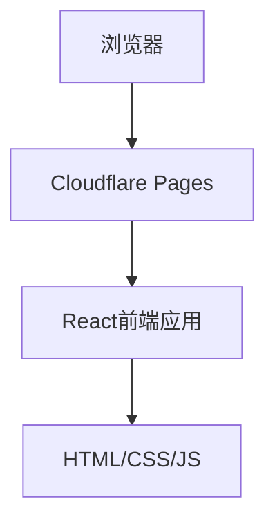

## 1. Architecture Design
纯静态网站架构，使用React构建前端页面，部署到Cloudflare Pages

## 2. Technology Description
- Frontend: React@18 + TypeScript + tailwindcss@3 + vite
- Initialization Tool: vite-init
- Backend: None（纯静态网站）
- Database: None
- Deployment: Cloudflare Pages

## 3. Route Definitions
| Route | Purpose |
|-------|---------|
| / | 首页，展示个人信息和课程列表 |

## 4. API Definitions
无需API，纯静态网站

## 5. Server Architecture Diagram
无需后端服务器

## 6. Data Model
无需数据库
