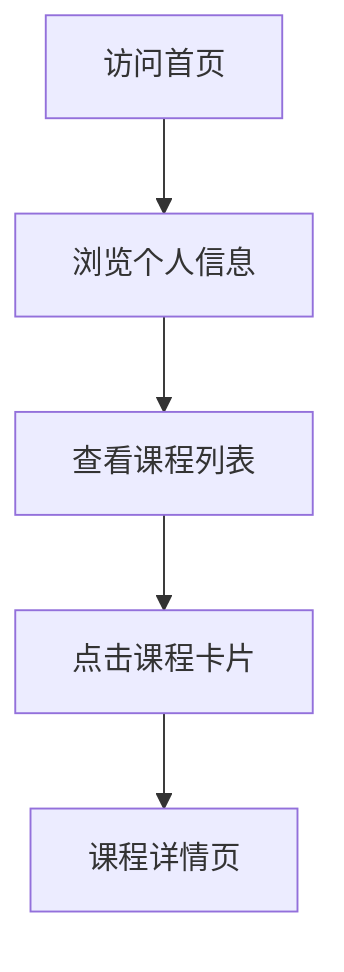

## 1. Product Overview
林进娟的个人学习网站，展示广东科学技术职业学院商学院商务数据分析与应用专业的课程学习内容
- 主要面向个人学习记录和课程内容展示，目标是为用户提供清晰的课程导航和内容管理
- 便于后续补充各个课程的详细学习内容

## 2. Core Features

### 2.1 User Roles
无需用户角色区分，纯静态展示网站

### 2.2 Feature Module
1. **首页**: 个人信息介绍、课程列表展示、导航栏
2. **课程详情页**: 各课程的学习内容展示（预留）

### 2.3 Page Details
| Page Name | Module Name | Feature description |
|-----------|-------------|---------------------|
| 首页 | 个人介绍 | 显示姓名、学校、专业信息 |
| 首页 | 课程列表 | 卡片式展示所有课程，包含课程名称和简介 |
| 首页 | 导航栏 | 顶部导航，包含首页和各课程链接 |

## 3. Core Process
用户访问首页 → 浏览个人信息 → 查看课程列表 → 点击课程进入详情页（后续开发）

## 4. User Interface Design
### 4.1 Design Style
- 主色调：蓝色系（代表知识、专业），辅以清新的白色和浅灰
- 按钮风格：圆角矩形，带有悬停动画效果
- 字体：使用优雅的中文字体，标题醒目，正文易读
- 布局风格：卡片式布局，响应式设计
- 图标风格：简洁的线性图标

### 4.2 Page Design Overview
| Page Name | Module Name | UI Elements |
|-----------|-------------|-------------|
| 首页 | Hero区域 | 大标题、个人介绍、渐变背景、平滑动画 |
| 首页 | 课程卡片 | 卡片网格、课程图标、名称、简介、悬停效果 |
| 首页 | 页脚 | 版权信息、联系方式 |

### 4.3 Responsiveness
桌面优先设计，同时适配平板和移动设备，使用Flexbox和Grid布局实现响应式效果

### 4.4 3D Scene Guidance
本项目不需要3D场景
